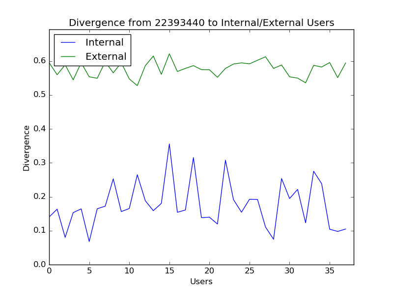

# twitter_LDA_topic_modeling
Uses the Gensim library in Python to create a corpus from documents and train an LDA model.
The model is used to evaluate similarities in conversations between Twitter users.
The groups of Twitter users being evaluated were found using community detection algorithms. Tweepy was used to communicate with the Twitter API. Matplotlib and pyLDAvis were used to produce illustrations of the data. Scipy, Numpy and NLTK were used during processing of the data. 

## Hello Worlds

  

